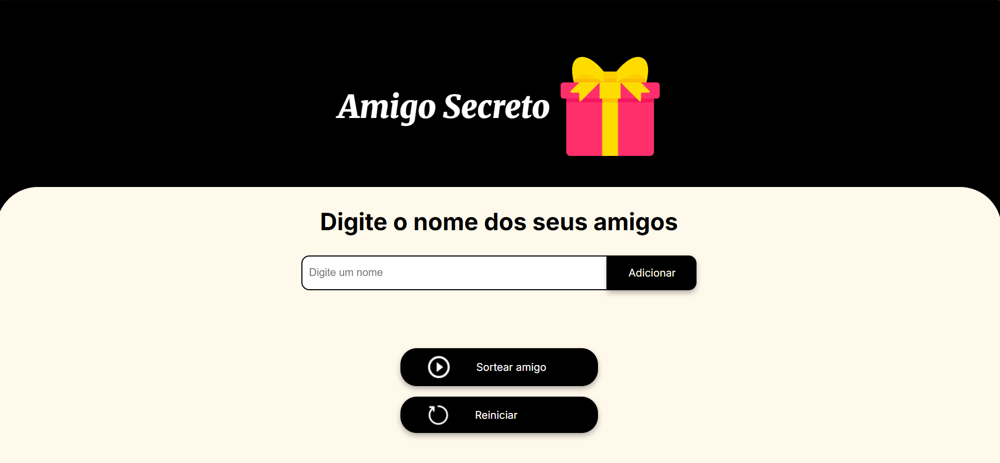

# 🎁 Amigo Secreto

Uma aplicação interativa que sorteia um amigo secreto a partir de uma lista definida pelo usuário.

## 🚀 Funcionalidades

- Adicione nomes de amigos em um campo de entrada
- Exiba a lista atual de amigos inseridos
- Sorteie aleatoriamente um amigo secreto da lista
- Exiba o resultado na tela

## 🛠️ Tecnologias utilizadas

- HTML5
- CSS3
- JavaScript

## Imagens

